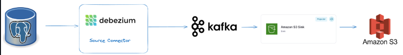

# Data Pipeline Setup: PostgreSQL to Kafka to S3

This project demonstrates how to set up a data pipeline to source data from a PostgreSQL database to Apache Kafka in Confluent Cloud using the Confluent JDBC Source Connector, and then sink the data to an Amazon S3 bucket using the Confluent S3 Sink Connector.

## Architecture




## Overview

This document provides a step-by-step guide for sourcing data from a PostgreSQL database to Kafka and then sinking it into an S3 bucket using Confluent Cloud connectors.

## Prerequisites

Before proceeding, ensure the following are available:
- **Confluent Cloud Account**: You need access to a Confluent Cloud account.
- **Kafka Cluster**: A running Kafka cluster in Confluent Cloud.
- **Confluent Cloud Connectors**: Access to the Confluent Cloud Connectors.
- **PostgreSQL Database**: Access to a PostgreSQL database.
- **Amazon S3**: Access to an S3 bucket for data storage.

## Step-by-Step Instructions

### 1. Set Up PostgreSQL JDBC Driver

Confluent Cloud manages the JDBC driver internally, so you don’t need to upload it manually. Just ensure that your PostgreSQL instance is accessible from Confluent Cloud.

### 2. Configure the JDBC Source Connector

#### Create a New Connector:

1. Log in to the Confluent Cloud Console.
2. Navigate to the **Connectors** section under your Kafka cluster.
3. Click on **Create Connector**.
4. Select **JDBC Source Connector** from the available connectors.

#### Configure the JDBC Source Connector:

1. Fill in the required configuration details:
    - **Connector Name**: `jdbc-source-postgres`
    - **Connection URL**: `jdbc:postgresql://<POSTGRES_HOST>:<POSTGRES_PORT>/`
    - **Connection User**: `<POSTGRES_USER>`
    - **Connection Password**: `<POSTGRES_PASSWORD>`
    - **Mode**: Select `Incrementing` or `Timestamp`, depending on your use case.
    - **Incrementing Column Name**: Specify the column for the incrementing mode.
    - **Table Whitelist**: Specify the tables to include (e.g., `schema.table1,schema.table2`).
    - **Topic Prefix**: e.g., `postgres-` to set the prefix for Kafka topics.
2. Save the configuration.

### 3. Configure the S3 Sink Connector

#### Create a New Connector:

1. In the Confluent Cloud Console, navigate to the **Connectors** section.
2. Click on **Create Connector**.
3. Select **S3 Sink Connector** from the available connectors.

#### Configure the S3 Sink Connector:

1. Fill in the required configuration details:
    - **Connector Name**: `s3-sink`
    - **Topics**: Enter the Kafka topics to sink data from (e.g., `postgres-table1`).
    - **S3 Bucket Name**: Specify your S3 bucket name.
    - **S3 Region**: Specify the AWS region of your S3 bucket.
    - **Format**: Choose the format (e.g., JSON or Avro).
    - **Flush Size**: Number of records before writing to S3 (e.g., 10000).
    - **Partitioner Class**: Set up as needed (e.g., `TimeBasedPartitioner`).
2. Save the configuration.

## Result

After the configuration is complete, the pipeline will automatically source data from the PostgreSQL tables and sink it into the specified S3 bucket in the chosen format.


## Commands

### Creating the JDBC Source Connector:
```bash
confluent connect create --connector jdbc-source-postgres --config ./jdbc-source-connector.json


Creating the S3 Sink Connector:

    confluent connect create --connector s3-sink --config ./s3-sink-connector.json


Validate Kafka Topics:

    kafka-topics --list --bootstrap-server <KAFKA_BOOTSTRAP_SERVER>


Monitoring the Pipeline:

    confluent connect status <CONNECTOR_NAME>


